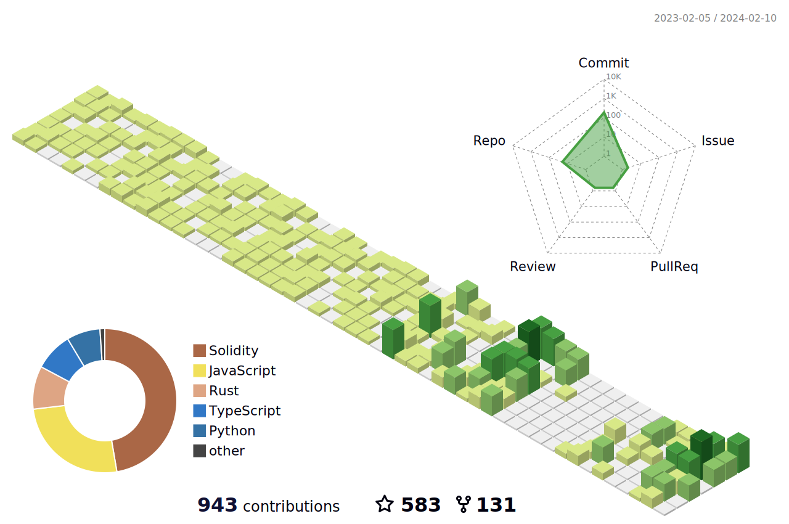

<!--   my-icons -->

    
    
    
       

<!--   my-header-img -->

 
<!--   GitHub stats graph -->
### 📈 GitHub Activity Graph:
<!--  -->

| .                                                                                                                                       | .                                                                                                                         |
|-----------------------------------------------------------------------------------------------------------------------------------------|---------------------------------------------------------------------------------------------------------------------------|
|  |  |

</img>

<!--   profile-green-animate -->

<!--   grid-snake -->

<!--   skyline 

-->

<!--  2d history skills -->
</img>

### Profile Views 

#### Thanks for visiting :heart:

 
  

counting of visitors to this page in this section started from Sept 9, 2023

## Star History

 
[MIT](LICENSE)

---
  *If you liked my profile, you can Star ⭐ the repo and if you want to use this template you can Fork it and can use.* 
---
Would you ike to meet me?

If you want to contribute to any of my repositories, feel free to submit PRs, issues and email me. Pick a slot if you'd like to meet me and chat about proposals and ideas - but make sure to describe the agenda

---
  *I use an automatic subscription control system. Thus, everyone who subscribes to me, I will subscribe to those and I will respond, and vice versa, I will remove all those who unsubscribe from me from among those who should be followed.* 
---

